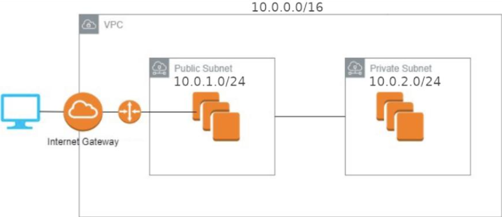
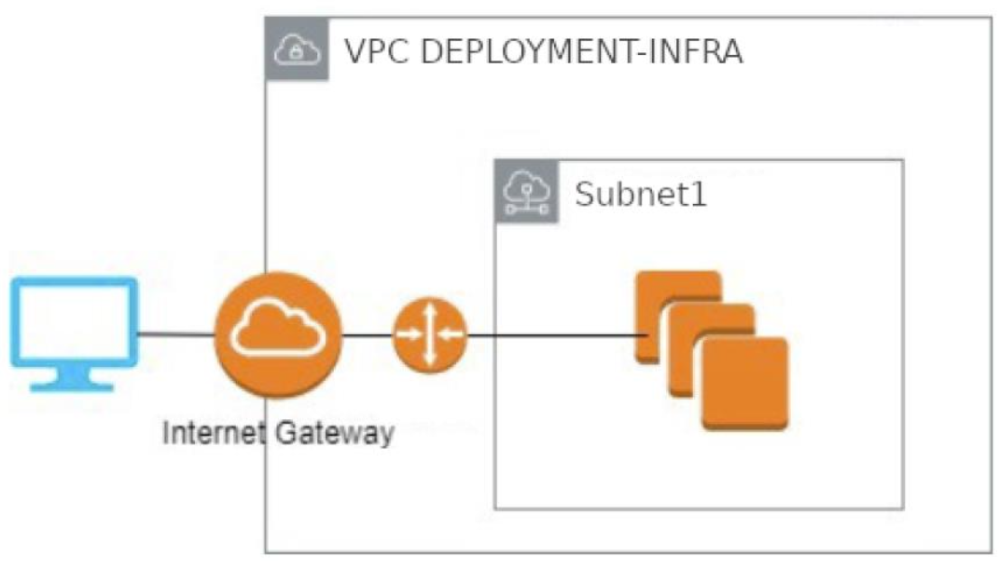
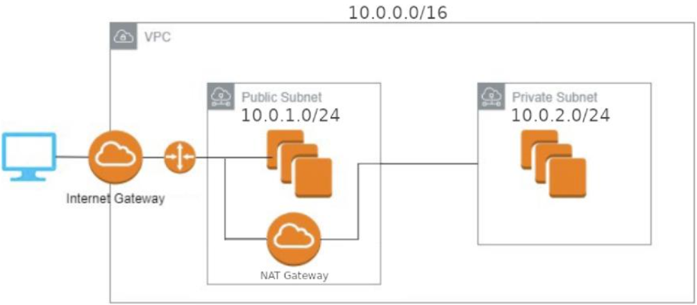
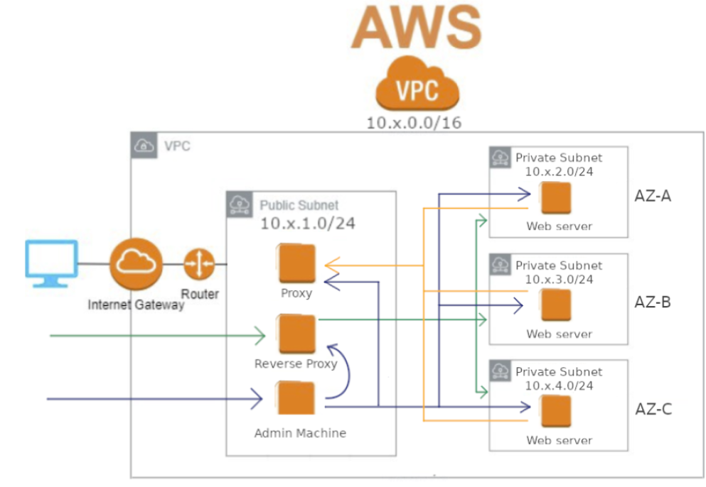

# Documentation des Infrastructures AWS

Ce référentiel contient la documentation des quatre infrastructures AWS déployées, chacune accompagnée de sa topologie respective. Vous trouverez ci-dessous des informations de base sur chaque infrastructure.

---
### Guide d'Utilisation

Ce guide vous expliquera comment utiliser le fichier `main.tf` pour déployer et gérer votre infrastructure.

## Prérequis

Avant de commencer, assurez-vous d'avoir les éléments suivants :
- [Terraform](https://www.terraform.io/downloads.html) installé sur votre machine.
- Un compte AWS avec les [credentials configurées](https://docs.aws.amazon.com/fr_fr/cli/latest/userguide/cli-configure-files.html) correctement.

## Configuration

1. Clonez ce dépôt sur votre machine locale :

```bash
git clone https://github.com/votre-utilisateur/votre-depot.git
```
Accédez au répertoire contenant le fichier main.tf :

  ```bash
  cd chemin/vers/votre-depot
  ```

Ouvrez le fichier main.tf avec votre éditeur de texte préféré.

Configurez les variables et les ressources Terraform selon vos besoins. Vous pouvez trouver des commentaires et des exemples dans le fichier main.tf pour vous guider.

#Déploiement
Une fois que vous avez configuré le fichier main.tf selon vos besoins, vous pouvez déployer l'infrastructure en utilisant Terraform. Exécutez les commandes suivantes :

  ```bash
  terraform init
  ```
Cela initialisera Terraform et téléchargera les plugins nécessaires.

   ```bash
   terraform plan
   ```
Cela vous montrera un aperçu des modifications qui seront apportées à l'infrastructure.

   ```bash
   terraform apply
   ````

Cela appliquera les modifications à l'infrastructure en créant ou en mettant à jour les ressources spécifiées dans le fichier main.tf.

#Nettoyage
Lorsque vous avez terminé avec l'infrastructure, vous pouvez la détruire en utilisant la commande suivante :

   ```bash
   terraform destroy
   ```
Cela supprimera toutes les ressources créées par Terraform.

Conclusion
Ce guide vous a montré comment utiliser le fichier main.tf pour déployer et gérer votre infrastructure à l'aide de Terraform. N'oubliez pas de consulter la documentation Terraform pour plus d'informations sur les fonctionnalités et les configurations possibles.

## Infrastructure 1

### Mise en place d'une infrastructure simple




### Configuration

- **Région AWS**: à adapter
- **Services AWS**:  à adapter
- **Réseaux VPC**: à adapter
- **Sécurité**: à adapter
- **Sous-réseaux**: à adapter


---


## Infrastructure 2

### Simple serveur web avec une IP publique directe




### Configuration

- **Région AWS**: à adapter
- **Services AWS**:  à adapter
- **Réseaux VPC**: à adapter
- **Sécurité**: à adapter
- **Sous-réseaux**: à adapter


---

## Infrastructure 3

### Serveur web derrière un reverse proxy




### Configuration

- **Région AWS**: à adapter
- **Services AWS**:  à adapter
- **Réseaux VPC**: à adapter
- **Sécurité**: à adapter
- **Sous-réseaux**: à adapter

---

## Infrastructure 4

###  Serveur Web avec Load Balancing AWS + Zone admin séparée


### Configuration

- **Région AWS**: à adapter
- **Services AWS**:  à adapter
- **Réseaux VPC**: à adapter
- **Sécurité**: à adapter
- **Sous-réseaux**: à adapter

### Guide d'Utilisation

Expliquez comment utiliser cette infrastructure, les points d'accès, les URL, les identifiants, etc.

---

## Infrastructure 5

### Projet final




### Configuration

- **Région AWS**: à adapter
- **Services AWS**:  à adapter
- **Réseaux VPC**: à adapter
- **Sécurité**: à adapter
- **Sous-réseaux**: à adapter


---

N'oubliez pas de personnaliser cette structure en remplaçant les valeurs entre crochets (`[...]`) par les informations spécifiques à vos infrastructures AWS. Vous pouvez également ajouter des détails supplémentaires, des captures d'écran ou des liens vers d'autres documents pertinents.


